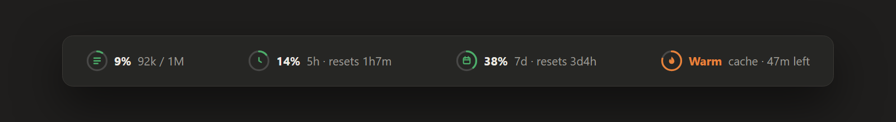
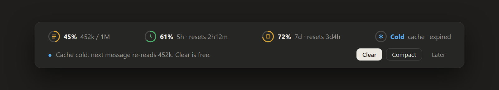
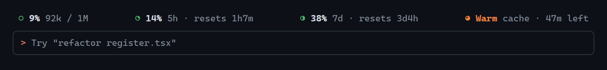

# usage-band

**Your Claude Code limits, context fill and prompt-cache warmth, right above the prompt.**



Four small rings, always in view:

| | What it shows |
|---|---|
| **Context** | How full the context window is: `92k / 1M` |
| **5h** | Your 5-hour usage limit, and when it resets |
| **7d** | Your weekly limit, and when it resets |
| **Cache** | Whether the prompt cache is **Warm** (and how long it has left) or **Cold** |

Rings go green → amber → red as you approach a limit.

## The big-context reminder

Above **400k tokens** of context, a reminder row appears with one-click actions. It knows the state of the cache and suggests the cheapest move:



| Situation | Message | Suggested |
|---|---|---|
| Cache is cold | *Cache cold: next message re-reads 452k. Clear is free.* | **Clear** |
| Cache expires within 10 min | *Cache expires in 6m: compact now while it's cheap.* | **Compact** |
| Cache is warm | *452k in context: each turn re-sends all of it.* | **Compact** |

**Later** hides the row until the context grows by another 100k.

Why this matters: a cached prompt is read at about a tenth of the normal input price. Once the cache has expired, your next message pays to read the whole conversation again, and so does `/compact`. `/clear` costs nothing.

## Terminal too

In terminal Claude Code it shows the same four items with text rings (`○ ◔ ◑ ◕ ●`):



## Install

```bash
claude plugin marketplace add Vosssa/claude-usage-band
claude plugin install usage-band@claude-usage-band --scope user
```

Restart Claude Code. The band appears in every session, in both the desktop app and the terminal.

Update later with:

```bash
claude plugin marketplace update claude-usage-band
claude plugin update usage-band@claude-usage-band
```

## Cost: zero tokens

`claude plugin details usage-band@claude-usage-band` reports **Always-on: ~0 tok**.

- It adds nothing to the prompt and never calls the model.
- The usage numbers are pushed to it by Claude Code after each response. It never polls for them.
- It runs one local timer, once a minute, to keep the countdowns current.

## Notes

- **The cache timer is an estimate.** It assumes a 1-hour cache TTL on a Claude subscription and 5 minutes on an API key. It counts from your last response.
- **The 5h and 7d rings need a subscription.** On an API key, only Context and Cache are shown.

## License

MIT
